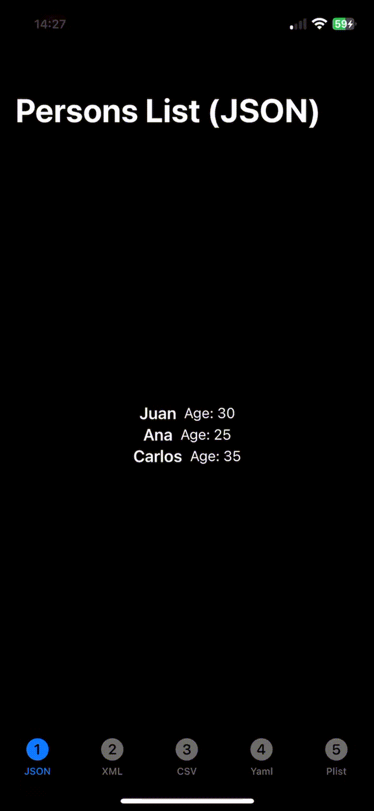

# BeyondCodable
This repository contains a sample iOS applicationt hat presents how to parse different types of text data files (JSON, XML, CSV, Plist, Yaml). This is the base code used in following post [Beyond JSON Codables](https://javios.eu/swift/beyond-json-codables/)

## Screenshots

## Requirements

- **Xcode 15.0 or later**
- **iOS 16.0 or later**
